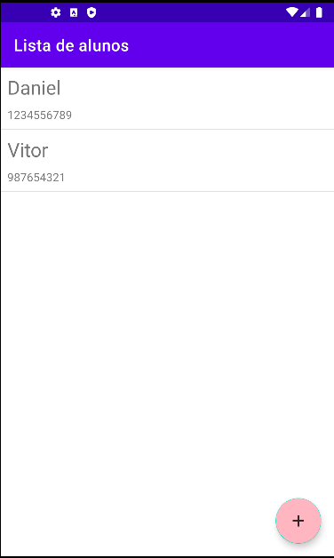

# Primeiro-App-Android

Criei **meu primeiro app android nativo** usando Android Studio e Java.

## 📲 Demonstração

O aplicativo permite o cadastro de novos alunos. Após o cadastro ser feito a lista é atualizada mostrando todos os alunos cadastrados.

Também fiz com que o aplicativo previna o cadastro de alunos sem nome ou com apenas espaço.

Adicionei a edição das informações do aluno:

É possivel deletar o aluno segurando e selecionando deletar no menu de contexto:

Novo layout item aluno:

## 🆕 Atualização

Agora o aplicativo tem persistência de dados, criei um banco de dados utilizando a biblioteca Room.
Dessa forma os dados não são perdidos caso o app seja finalizado ou desligue o celular! 

## Instalação

Baixe o Android Studio e clone esse projeto utilizando essa [URL](https://github.com/danielh-oliveira/Primeiro-App-Android.git)
